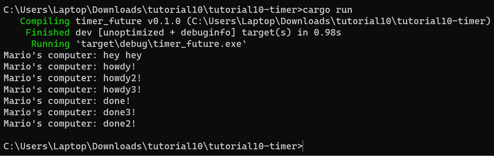
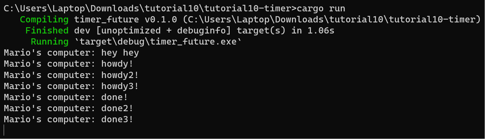

# REFLECTION

## 1.2: Understanding how it works

Hasil setelah menjalankan program tersebut adalah `println!("Mario's computer: hey hey");` dieksekusi terlebih dahulu daripada println yang ada di dalam `spawner.spawn`. Hal ini terjadi karena `println!("Mario's computer: hey hey");` tidak berada dalam async function yang perlu menunggu untuk di-spawn terlebih dahulu. Ketika program dijalankan, ada dua program yang dijalankan secara bersamaan yaitu program pada `main` function dan program pada asynchronous function yang bekerja diluar `main` function secara asinkronus. Oleh karena itulah "hey hey" diprint terlebih dahulu pada command line lalu dilanjutkan dengan "howdy!" dan "done!".

## 1.3: Multiple Spawn and removing drop
### Output multiple spawn

### Output removing drop

Berdasarkan hasil yang ditunjukkan, dapat dilihat bahwa dengan membuat multiple spawn tanpa menghilangkan drop, program akan berhenti setelah selesai dijalankan karena input sudah dibatasi dengan adanya `drop(spawner)`. Jadi semua task sudah ditambahkan sebelum program berjalan. Selain itu akan ada penambahan atrian task yang harus dijalankan. Di lain hal, jika kita menghilangkan `drop(spawner)`, program tidak akan berhenti dan terus menunggu input baru dari spawner karena tidak ada penanda bagi executor yang menunjukkan bahwa tidak ada lagi task yang perlu dijalankan.