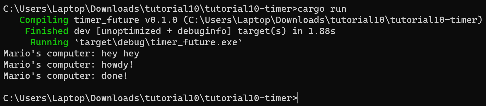

# REFLECTION

## 1.2: Understanding how it works

Hasil setelah menjalankan program tersebut adalah `println!("Mario's computer: hey hey");` dieksekusi terlebih dahulu daripada println yang ada di dalam `spawner.spawn`. Hal ini terjadi karena `println!("Mario's computer: hey hey");` tidak berada dalam async function yang perlu menunggu untuk di-spawn terlebih dahulu. Ketika program dijalankan, ada dua program yang dijalankan secara bersamaan yaitu program pada `main` function dan program pada asynchronous function yang bekerja diluar `main` function secara asinkronus. Oleh karena itulah "hey hey" diprint terlebih dahulu pada command line lalu dilanjutkan dengan "howdy!" dan "done!".